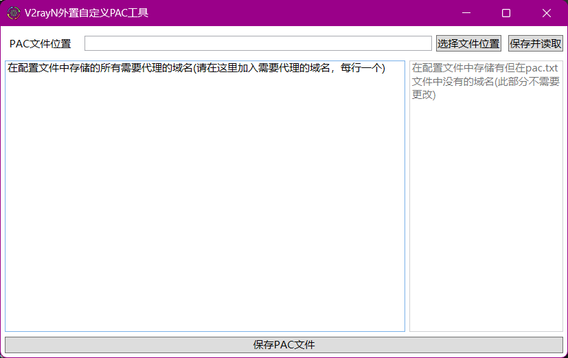
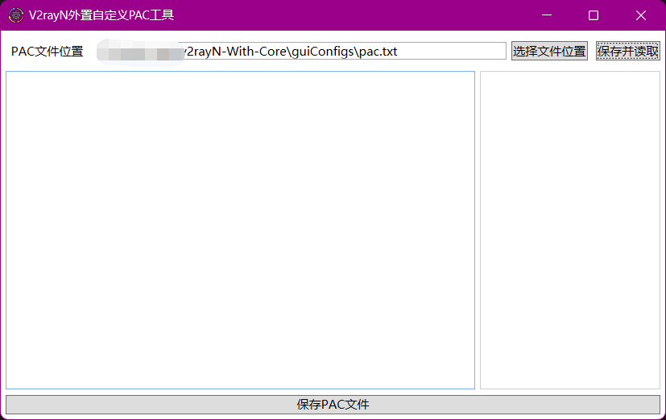
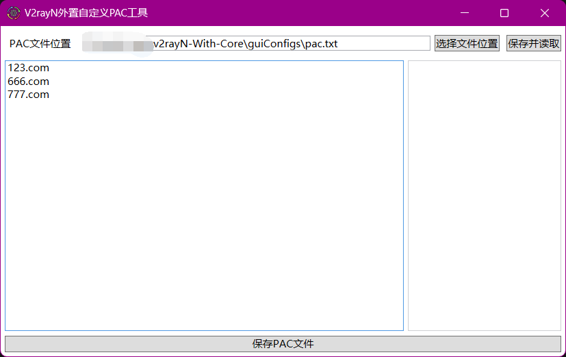
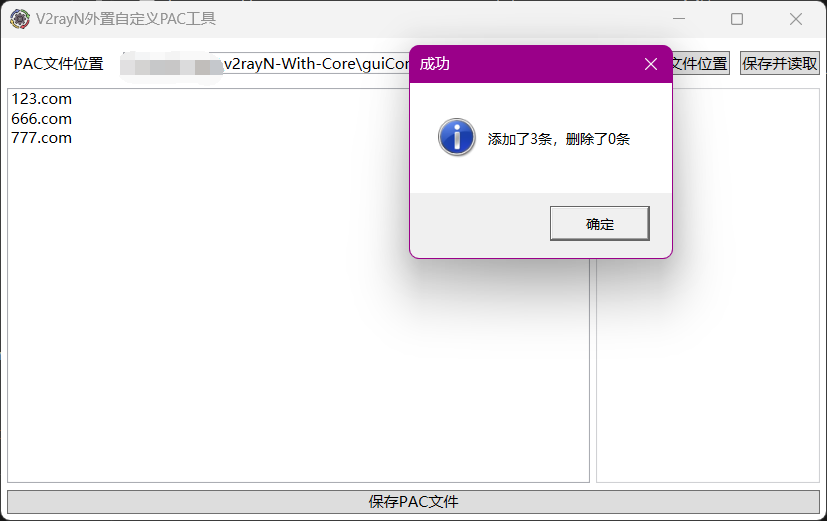

# V2rayNCustomizePAC

## 如何使用
首先，你需要下载6.21及以上的V2rayN客户端，然后打开本程序中的`V2rayNCustomizePAC.exe`，程序会自动生成配置文件`PAConfig.json`。

然后，点击`选择文件位置`，选择V2rayN目录下的pac.txt文件，通常在`guiConfigs/pac.txt`，之后点击 `保存并读取`。此时程序会自动记录pac文件位置，不用每次都进行选择。

之后，在左边的输入框，输入你想要加入的域名，每行一个，类似格式如下

点击`保存PAC文件`将域名保存到pac.txt中，然后`重启V2rayN`，即可生效。

你自定义的域名将保存在`PAConfig.json`中，当pac.txt文件更新时，会在右面列出pac.txt和PAConfig.json中的不同，可供参考。